# 連携認証台帳（デモ版）仕様書

リポジトリ名：**`auth-link-triage-ledger-demo`**

---

## 1. 概要

### 1.1 課題

「Google でログイン」「Apple でサインイン」等の連携認証により、1 つの提供元アカウントの認証状態に多数のサービスのログインがぶら下がっている。提供元のセッション失効・パスワード変更・端末変更が起きると、依存するサービスが時間差で次々にログイン失敗を起こすが、利用者に見えるのは末端の「セッションが切れました」という表示だけであり、**どの提供元が失効の起点か**を特定できない。また再ログインには提供元→依存サービスという順序があり、順序を誤ると同じ失敗を繰り返す。

本成果物は、サービス間の認証依存を台帳として記録し、ログイン失敗の観測から失効の起点を切り分け、記録済みの再ログイン手順を依存順に提示する。

### 1.2 対象エディション

**デモ版（アイデアの視覚化）**

技術と UX を体験させる展示物として、安全・手軽に動かせることを最優先する。デザイン・測定・保守・監視は対象外とする。

### 1.3 外部接続の扱い

提供元の認証状態をネットワーク越しに照会しない。台帳・観測・契機事象はすべて利用者の自己申告として記録し、切り分けは記録された依存関係と観測の整合のみから導く。資格情報（パスワード・ワンタイムコード・復旧コード等）は一切保持しない。

---

## 2. プラットフォーム選定

### 2.1 ターゲットの判別

成果物を直接読み・操作するのは**人間**である。よってターゲットは人間向けとする。

### 2.2 プラットフォーム

**ウェブ** を選択する。

- 台帳の登録・観測の入力に応じて切り分け結果と再ログイン順序が変わるため、動的な入力を必要とし、電子書籍・動画は該当しない
- ログイン失敗は任意の端末・任意の場面で起きるため、インストール不要でどの端末からも同じ台帳に到達できることが提供価値の中核である
- 切り分けは依存グラフの探索であり、ローカル LLM を必要としないためデスクトップを選択する理由がない

### 2.3 構成方針

**デモ版の簡略構成（Cloudflare 一本化）** を選択する。台帳の CRUD と表示が主体であり、切り分けは数十ノード規模のグラフ探索で Worker の実行時間内に完了するためである。AI・解析・画像加工等の重い処理を持たない。

| 層 | 技術 | デプロイ先 | 役割 |
|---|---|---|---|
| フロントエンド | Next.js（TypeScript、静的書き出し） | Cloudflare Pages（無料） | 台帳画面・切り分け画面・手順画面 |
| アプリケーション | Cloudflare Workers（TypeScript） | Cloudflare（無料） | 台帳 API・切り分け計算・セッション管理・日次リセット |
| DB | D1（SQLite） | Cloudflare（無料） | 台帳・観測・契機事象・ケースの保持 |

日次リセットは Cron Trigger により Worker から実行する。フロントエンドとアプリケーションの通信は自システム内の通信であり、外部 API に該当しない。

---

## 3. 用語定義

| 用語 | 定義 |
|---|---|
| サービス | 台帳に登録される 1 単位。提供元にも依存側にもなり得る |
| 提供元 | 他のサービスから認証状態を依存されるサービス |
| 連携 | 「サービス A のログインはサービス B の認証状態に依存する」という有向の関係 |
| 主経路 | サービスが実際にログインに用いている連携。1 サービスにつき最大 1 本 |
| 代替経路 | 主経路とは別に利用可能な連携（パスワードログイン等）。失効は伝播しない |
| 伝播種別 | 連携の性質。**即時**：提供元の失効が直ちに依存側の失敗となる。**遅延**：依存側が自前のセッションを持ち、次回の再認証まで失敗が表面化しない |
| 観測 | 利用者が申告する「あるサービスが、ある時刻に、ログイン失敗／稼働中であった」という事実 |
| 契機事象 | 失効の原因となり得る操作。パスワード変更・多要素認証の再設定・端末の変更・全端末からのログアウト・アカウント復旧 |
| 失効起点 | 観測された失敗群を最もよく説明する、失効が始まったサービス |
| 予測影響集合 | ある起点から主経路を辿って到達する全サービス（起点を含む） |
| 切り分けケース | 最初の失敗観測から解決までを束ねる単位 |
| 確認推奨 | 起点候補を絞り込むために、稼働状況を確認する価値が高いサービス |
| 再ログイン手順 | サービスごとに記録される、再ログインの操作の順序 |
| 観測窓 | 切り分けに用いる観測の有効期間。72 時間 |
| セッションキー | ブラウザごとに発行される不透明識別子。DB レコードのオーナーキー |

---

## 4. スコープ

### 4.1 対象

- サービスと連携（主経路・代替経路・伝播種別）の登録・編集・削除
- 再ログイン手順の記録・編集
- ログイン失敗・稼働確認の観測と契機事象の記録
- 観測から失効起点を切り分け、候補の順位・根拠・予測影響集合・確認推奨を提示すること
- 選択した起点に対する再ログイン順序の提示と、再ログイン完了の記録による解決
- 提供元テンプレートからのサービス名の補完

### 4.2 対象外

- 提供元への認証状態の照会、およびそのための資格情報の入力・保持
- ユーザー認証・認可
- 資格情報・ワンタイムコード・復旧コードの保管
- 複数利用者間での台帳の共有
- 台帳のエクスポート・インポート

---

## 5. システム構成

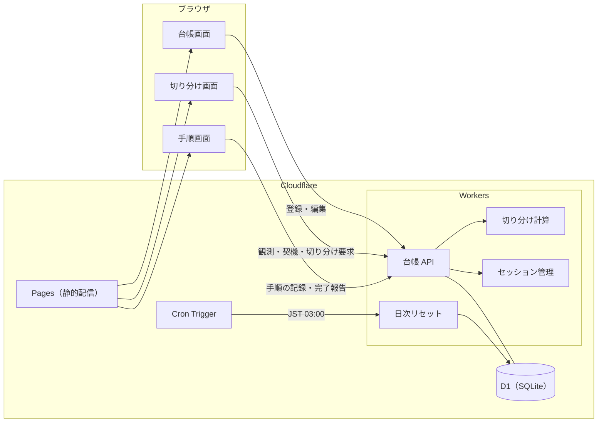

---

## 6. 台帳仕様

### 6.1 サービス

| 項目 | 内容 |
|---|---|
| 名称 | 利用者が付ける任意のラベル。提供元テンプレートから補完できる |
| 備考 | 任意の自由記述 |
| 種別 | 連携の有無から導出する。依存されるのみ＝提供元、依存するのみ＝依存側、双方＝中継。利用者は入力しない |

**要件**

- 名称は同一セッション内で一意とすること
- サービスの削除は、そのサービスを提供元とする連携が存在する場合に拒否すること。依存側の連携は連鎖して削除すること
- 提供元テンプレートは名称の補完のみに用い、テンプレート由来であることに意味を持たせないこと

### 6.2 連携

| 項目 | 内容 |
|---|---|
| 依存側 | 認証状態を依存するサービス |
| 提供元 | 依存されるサービス |
| 経路種別 | 主経路／代替経路 |
| 伝播種別 | 即時／遅延 |

**要件**

- 依存側と提供元が同一の連携を拒否すること
- 連携の追加によってグラフに循環が生じる場合、追加を拒否し、循環を構成するサービス列を表示すること
- 1 つのサービスが持つ主経路は最大 1 本とすること。2 本目の主経路を登録する場合は、既存の主経路を代替経路へ降格することを利用者に明示して選択させること
- 代替経路には伝播種別を持たせないこと。代替経路は失効を伝播せず、再ログイン順序における迂回の案内にのみ用いる
- 伝播種別の既定値は遅延とすること。即時の連携（毎回の要求が提供元の認証状態を参照するもの）は利用者が明示的に選択する

### 6.3 再ログイン手順

**要件**

- 手順はサービスごとに順序付きの手順項目として記録すること。手順項目は自由記述とし、1 項目の長さに上限を設けること
- 手順にはパスワード・ワンタイムコード・復旧コード・秘密の質問の答えを記録しないことを、入力欄に常時表示すること
- 手順の記録は任意とし、未記録のサービスは再ログイン順序の提示において「未記録」として明示すること
- 手順の編集は、その手順が過去のケースで参照されていても許容すること。ケースは手順の内容を複製せず、参照のみを保持する

---

## 7. 観測・契機事象の記録仕様

### 7.1 観測

| 項目 | 内容 |
|---|---|
| 対象サービス | 観測されたサービス |
| 状況 | 失敗／稼働 |
| 観測時刻 | 既定は現在時刻。観測窓の範囲内で過去へ変更できる |

**要件**

- 同一サービスに複数の観測がある場合、最新の観測時刻のものをそのサービスの現在の状況とすること
- 観測窓（72 時間）より古い観測は切り分けの入力から除外すること。除外された観測は履歴として閲覧できること
- 未来の観測時刻を拒否すること
- 失敗の観測が登録された時点で、開いている切り分けケースが存在しなければ新たにケースを開くこと。ケースが開いていれば、その観測をケースに紐づけること

### 7.2 契機事象

| 種別 | 内容 |
|---|---|
| パスワード変更 | 対象サービスのパスワードを変更した |
| 多要素認証の再設定 | 認証器・登録端末を変更した |
| 端末の変更・初期化 | 新しい端末に移行した、または端末を初期化した |
| 全端末からのログアウト | 対象サービスの全セッションを無効化した |
| アカウント復旧 | 復旧手続きによりアカウントに再アクセスした |

**要件**

- 契機事象は対象サービスと発生時刻を持ち、発生時刻は現在より前であること
- 契機事象は失効起点の候補を排除する根拠には用いず、加点の根拠にのみ用いること。契機事象は利用者の記憶に基づく申告であり、観測より確度が低いためである

---

## 8. 切り分け仕様

### 8.1 入力

- 依存グラフ：全サービスと全連携。切り分けにおける伝播は**主経路のみ**を辿る
- 現在の状況：観測窓内の最新観測から導いた、サービスごとの失敗／稼働／未観測
- 失効開始時刻：ケース内で最も早い失敗観測の時刻
- 契機事象：失効開始時刻の 7 日前から現在までに発生したもの

### 8.2 候補の列挙

失敗しているサービスそれぞれについて、そのサービス自身と、主経路を上流へ辿って到達する全ての提供元を候補とする。候補の和集合を候補集合とする。

### 8.3 候補ごとの評価

各候補について以下を求める。

| 項目 | 定義 |
|---|---|
| 予測影響集合 | 候補自身と、主経路を下流へ辿って到達する全サービス |
| 説明できる失敗 | 失敗しているサービスのうち、予測影響集合に含まれるもの |
| 説明できない失敗 | 失敗しているサービスのうち、予測影響集合に含まれないもの |
| 矛盾する稼働 | 予測影響集合に含まれ、失効開始時刻以降に稼働と観測され、かつ候補から**即時の連携のみで構成される経路**で到達するサービス |
| 未観測の予測 | 予測影響集合のうち、失敗とも稼働とも観測されていないもの |
| 契機の有無 | 候補自身に契機事象が記録されているか |

**要件**

- 候補から稼働サービスへの経路が 1 つでも即時の連携のみで構成されるならば矛盾とすること。全ての経路に遅延の連携が含まれる場合は、稼働サービスが自前のセッションで動作している可能性があるため矛盾としないこと
- 候補自身が失効開始時刻以降に稼働と観測されている場合は、経路の種別によらず矛盾とすること
- 説明できる失敗が 0 の候補は評価対象から外すこと

### 8.4 除外

矛盾する稼働を 1 つでも持つ候補は順位付けから除外し、「除外された候補」として矛盾の根拠となったサービスとともに表示する。

### 8.5 順位付け

除外されなかった候補を以下の優先順で並べる。

| 優先 | 基準 | 意図 |
|---|---|---|
| 1 | 説明できる失敗の数が多い | 観測された失敗を最も広く説明する |
| 2 | 契機の有無（有を先） | 申告された原因と整合する |
| 3 | 未観測の予測の数が少ない | 観測されていない失敗を過剰に予測しない（最小説明） |
| 4 | 主経路の深さが浅い（上流を先） | 同等ならば上流を優先する |

**要件**

- 順位ごとに、上表のどの基準で前後が決まったかを根拠として表示すること
- 第 1 位の候補であっても、説明できない失敗が残る場合は「単一の起点では説明できない」旨を明示すること

### 8.6 複数起点

第 1 位の候補で全ての失敗を説明できない場合、説明できなかった失敗のみを対象として 8.2〜8.5 を再度適用し、第 1 位を起点に追加する。これを全ての失敗が説明されるか、起点が 3 つに達するまで繰り返す。

**要件**

- 追加された起点は、先に選ばれた起点の予測影響集合に含まれないこと
- 起点が 3 つに達しても説明できない失敗が残る場合は、残った失敗を「未説明」として表示し、台帳の連携が不足している可能性を案内すること

### 8.7 確認推奨

上位 3 候補（複数起点の場合は各起点の上位 3 候補）の予測影響集合を比較し、いずれか一方にのみ含まれ、かつ未観測のサービスを求める。候補の組を最も多く区別するサービスから順に、最大 3 件を確認推奨として表示する。

**要件**

- 候補が 1 つのみの場合、または区別できる未観測のサービスが存在しない場合、確認推奨を表示しないこと
- 確認推奨のサービスに対して、その画面から直接、稼働／失敗の観測を登録できること

### 8.8 出力

| 項目 | 内容 |
|---|---|
| 起点候補 | 順位・サービス・根拠・説明できる失敗・未観測の予測 |
| 除外された候補 | サービス・矛盾の根拠となった稼働サービス |
| 複数起点 | 起点の列と、それぞれが説明する失敗 |
| 未説明 | どの起点でも説明できない失敗 |
| 確認推奨 | サービスと、その観測がどの候補を区別するか |

**要件**

- 切り分けは観測・契機事象・連携のいずれかが変更されるたびに再計算し、過去の計算結果を保持しないこと
- 計算に用いた観測の範囲（観測窓の始点・終点）を出力に含めること

---

## 9. 再ログイン順序の提示仕様

利用者が起点候補から 1 つを選択した時点で、その起点の予測影響集合に対する再ログイン順序を提示する。

**要件**

- 順序は主経路に沿った依存順（提供元を先、依存側を後）とし、起点を先頭に置くこと。同順位のサービスは名称順とすること
- 失効開始時刻以降に稼働と観測されているサービスは順序から除外し、除外した旨を表示すること
- 各サービスに記録済みの再ログイン手順を展開して表示し、未記録のサービスは「未記録」と表示して手順画面への導線を置くこと
- 代替経路を持つサービスについて、代替経路の提供元が失敗と観測されていない場合、「代替経路で先にログインできる」旨を併記すること
- 各サービスに「再ログイン完了」の操作を置き、完了は稼働の観測として記録すること
- 予測影響集合の全サービスが稼働と観測された時点で、ケースを解決とし、選択した起点を記録すること
- 解決前に新たな失敗が観測された場合、ケースは継続し、切り分けを再計算すること

---

## 10. 画面仕様

### 10.1 台帳画面

| 領域 | 内容 |
|---|---|
| サービス一覧 | 名称・種別・主経路の提供元・伝播種別・手順の記録有無 |
| 依存図 | 主経路を実線、代替経路を破線で描いた有向図。即時・遅延を線種で区別する |
| 登録 | サービスと連携の追加・編集・削除。循環・主経路重複の拒否理由を表示する |
| テンプレート | 提供元テンプレートからの名称補完 |

### 10.2 切り分け画面

| 領域 | 内容 |
|---|---|
| 観測入力 | 対象サービス・失敗／稼働・観測時刻 |
| 契機入力 | 対象サービス・種別・発生時刻 |
| 現在の状況 | 観測窓内のサービスごとの状況を依存図上に重ねて表示する |
| 起点候補 | 順位・根拠・説明できる失敗・未観測の予測・除外された候補 |
| 確認推奨 | 確認すべきサービスと、その場での観測登録 |
| ケース | 開始時刻・状態・過去のケースの履歴 |

### 10.3 手順画面

| 領域 | 内容 |
|---|---|
| 再ログイン順序 | 選択した起点に対する依存順の列。各サービスの手順の展開・代替経路の案内・完了操作 |
| 手順編集 | サービスごとの手順項目の追加・並べ替え・削除。資格情報を記録しない旨の常時表示 |

---

## 11. データ設計

### 11.1 テーブル一覧

| テーブル | 用途 |
|---|---|
| sessions | ブラウザごとのセッション |
| services | 台帳のサービス |
| auth_links | サービス間の連携 |
| procedure_steps | サービスごとの再ログイン手順項目 |
| observations | 失敗／稼働の観測 |
| trigger_events | 契機事象 |
| triage_cases | 切り分けケース |
| case_origins | ケースで選択・記録された起点 |

すべてのテーブルは `session_id` を保持し、オーナーキーとして参照条件に必ず含める。

### 11.2 マスタデータ件数

| 区分 | 件数 |
|---|---|
| 経路種別 | 2 |
| 伝播種別 | 2 |
| 観測状況 | 2 |
| 契機事象種別 | 5 |
| ケース状態 | 5 |
| 順位付け根拠コード | 4 |
| 除外理由コード | 2 |
| 提供元テンプレート | 12 |

---

## 12. ER図

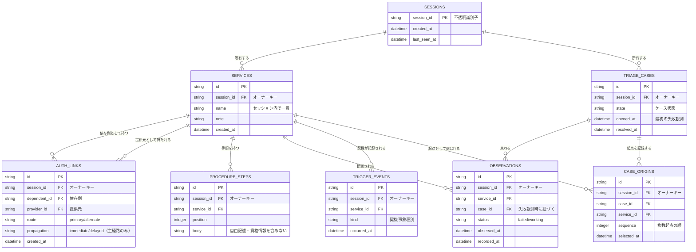

---

## 13. DFD

### 13.1 コンテキストレベル

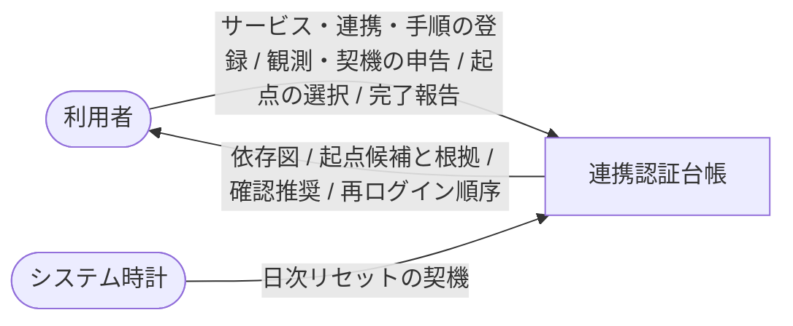

### 13.2 詳細レベル

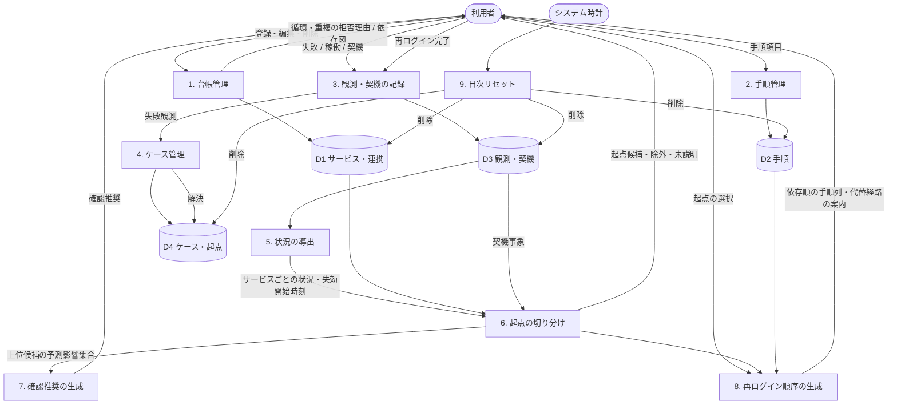

---

## 14. シーケンス図

### 14.1 台帳の登録

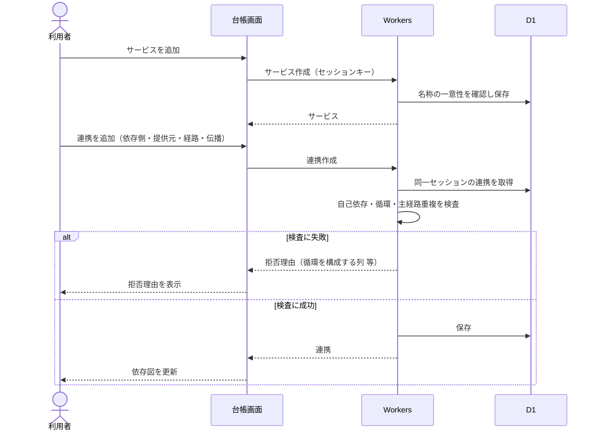

### 14.2 失敗の観測と切り分け

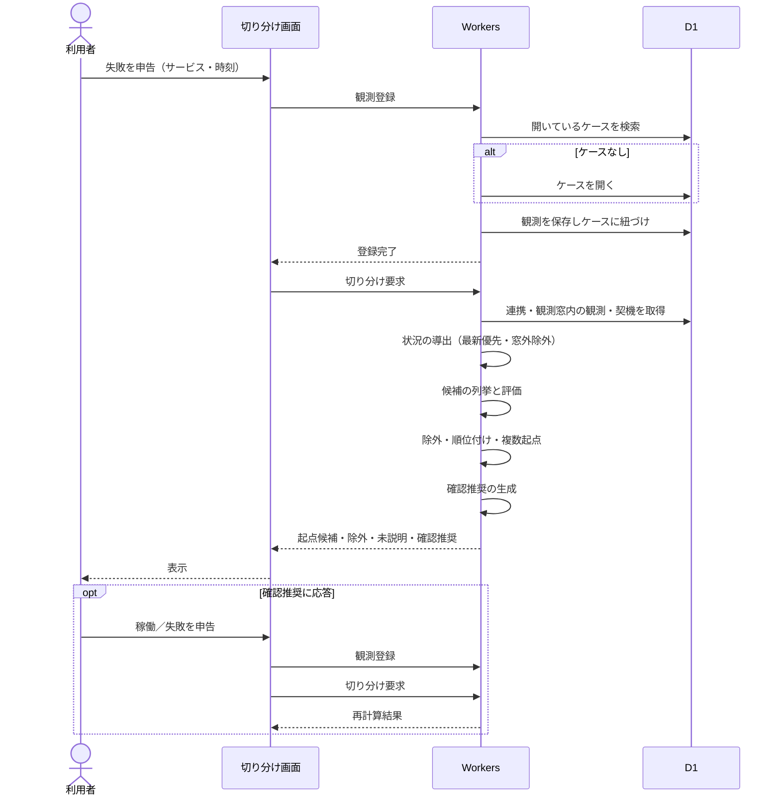

### 14.3 再ログインと解決

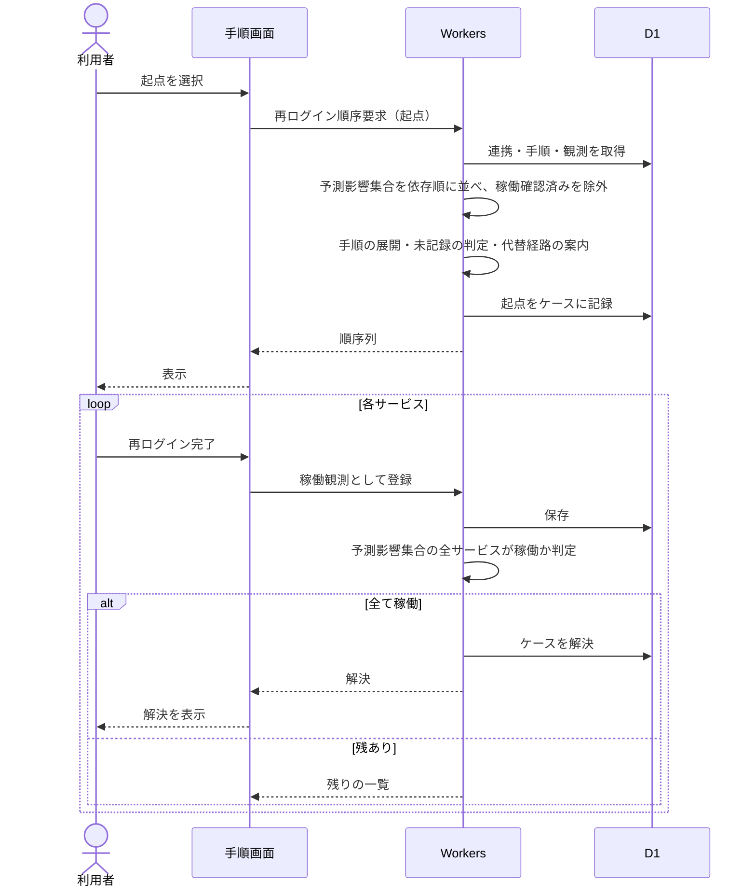

### 14.4 日次リセット

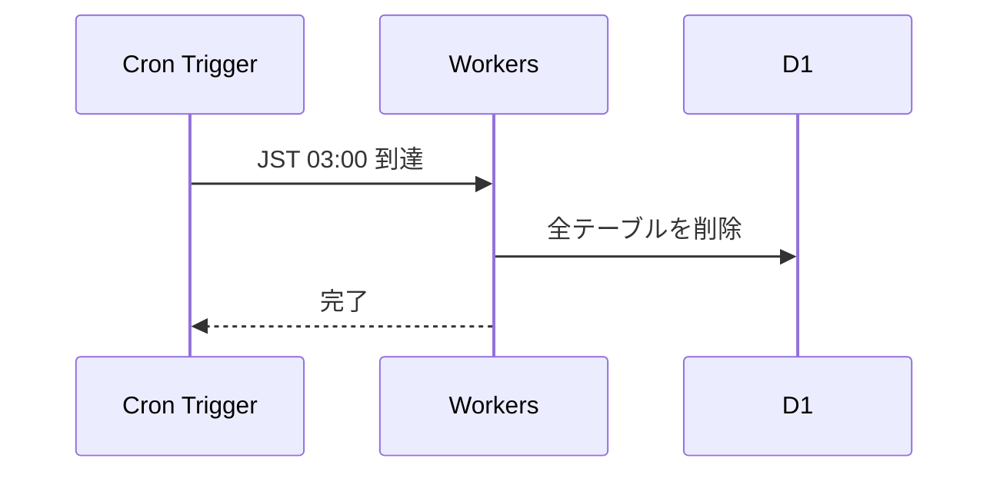

---

## 15. クラス図

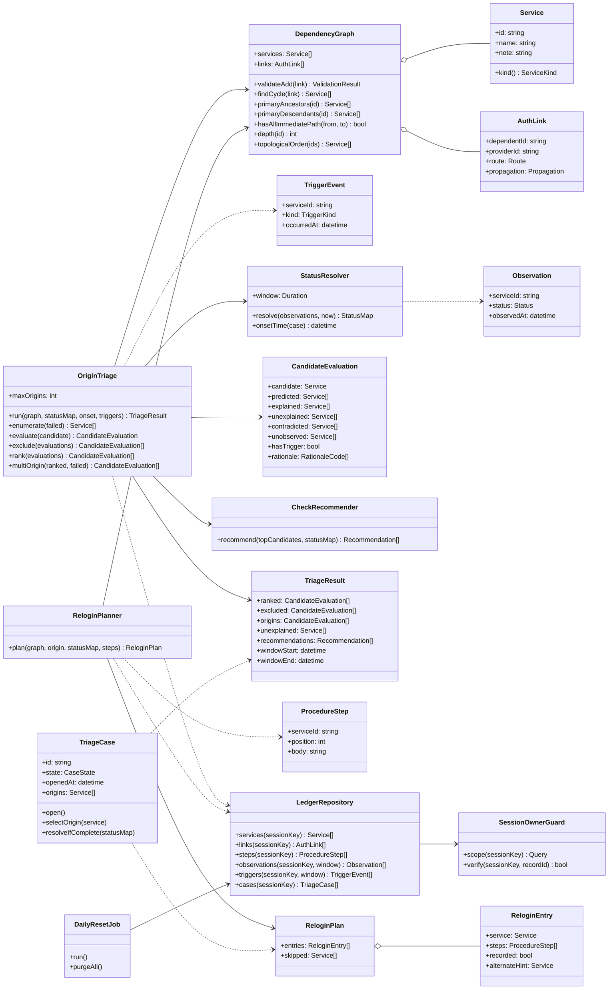

---

## 16. 状態遷移図

### 16.1 切り分けケース

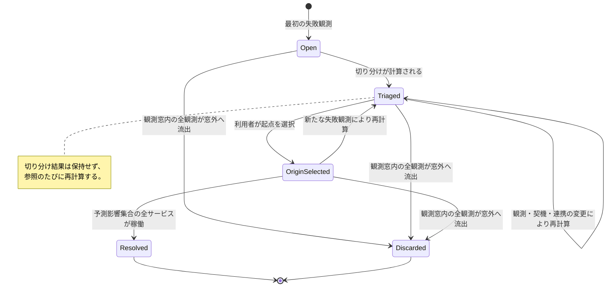

### 16.2 サービスの状況（切り分け上の導出状態）

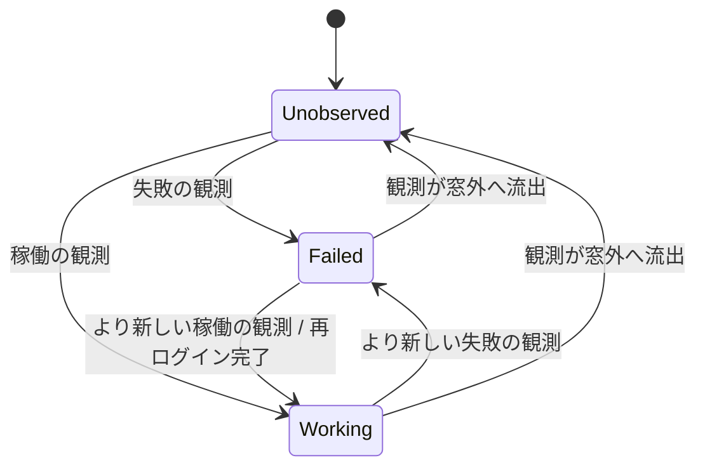

---

## 17. ユースケース図

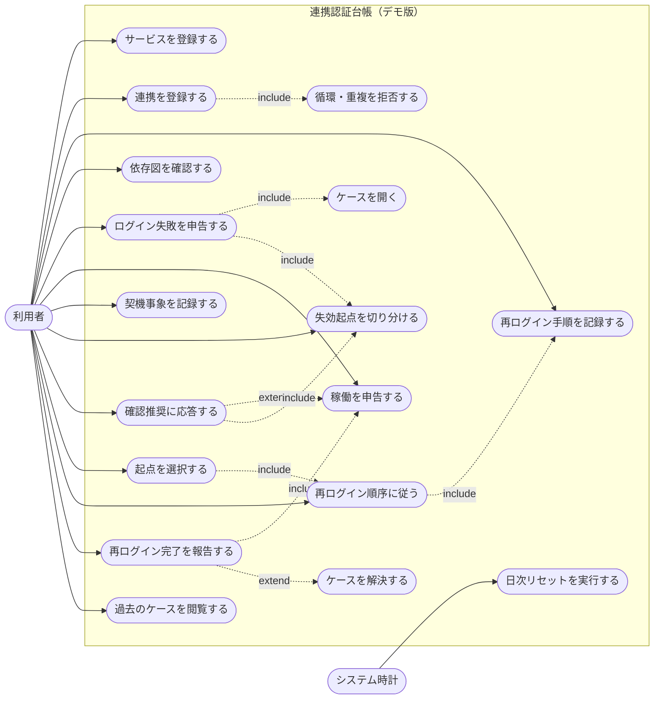

---

## 18. 非機能要件

| 区分 | 要件 |
|---|---|
| 実装方式 | 1 issue のワンショットで実装する |
| 外部通信 | 提供元を含む外部サービスへのネットワーク越しの呼び出しを行わない。資格情報を必要とする通信を持たない |
| 計算量 | 切り分けはサービス数と連携数に対して多項式時間で完了すること。同一セッションのサービス数・連携数・観測数に上限を設けること |
| 応答 | 切り分けと再ログイン順序の計算は 1 回の要求内で完結し、非同期処理を持たないこと |
| 決定性 | 同一の台帳・観測・契機に対して、切り分け結果と順序が常に同一であること |
| 資源 | 過去の切り分け結果を保持しないこと。観測・契機は日次リセットまで保持する |

---

## 19. セキュリティ・個人情報

**セキュリティ**

- 認証・認可を設計に組み込まない
- セッション管理（Cookie ＋ D1）を用い、セッションキーをオーナーキーとして全テーブルに付与する
- セッションをまたいだ DB レコードの参照・操作を行えないこと
- Bot 対策はハニーポット方式で行う。reCAPTCHA を用いない
- 手順項目・備考の自由記述は長さの上限を設け、表示時にエスケープすること

**個人情報**

| 項目 | 扱い |
|---|---|
| 氏名・ニックネーム | 使用しない |
| メールアドレス | 使用しない。サービス名称・備考・手順項目への入力を求めないことを画面に明示する |
| 生年月日・住所・電話番号 | 使用しない |
| アカウント名・ログイン ID | 保持しない。台帳が扱うのはサービスの名称と依存関係のみである |
| パスワード・ワンタイムコード・復旧コード | 保持しない。手順項目の入力欄に記録禁止を常時表示する |
| セッションキー | 端末識別子として扱う |

---

## 20. 運用要件

| 項目 | 内容 |
|---|---|
| DB | D1（SQLite）。デプロイ先を問わず SQLite を用いる |
| 日次リセット | JST 03:00 に全テーブルを削除する。Cron Trigger から実行する |
| 観測窓 | 72 時間。窓外の観測は切り分けに用いず、履歴としてのみ閲覧できる |
| 上限 | 1 セッションあたりのサービス数・連携数・観測数・手順項目数に上限を設け、超過時は登録を拒否する |
| 測定 | 行わない |
| 保守・監視 | 行わない |

---

## 21. 対応環境と制約

| 項目 | 内容 |
|---|---|
| 対応ブラウザ | 最新世代のデスクトップ向けおよびモバイル向けブラウザ |
| 対応端末 | デスクトップ・モバイル。ログイン失敗は任意の端末で起きるため、いずれからも同一の操作ができること |
| 前提 | 利用者が自身の利用サービスと連携の関係を把握し、自己申告できること。台帳に未登録の連携は切り分けに反映されない |
| 制約 | 提供元の実際の認証状態は照会しない。切り分け結果は台帳と申告の整合から導いた推定であり、その旨を画面に常時表示する |
